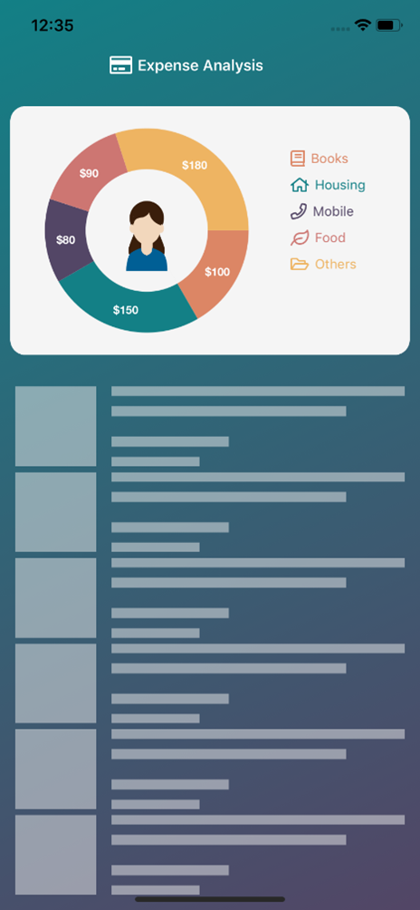

# How to add a custom view to a hole in the Xamarin.Forms doughnut charts

This article explains how to add the desired view to a hole in the  [doughnut series](https://help.syncfusion.com/cr/xamarin/Syncfusion.SfChart.XForms.DoughnutSeries.html) of [Xamarin.Forms chart](https://help.syncfusion.com/cr/xamarin/Syncfusion.SfChart.XForms.SfChart.html) by using the [CenterView](https://help.syncfusion.com/cr/xamarin/Syncfusion.SfChart.XForms.DoughnutSeries.html#Syncfusion_SfChart_XForms_DoughnutSeries_CenterView) property which has been supported from the Syncfusion.Xamarin.SfChart version of 16.4.0.41.

https://help.syncfusion.com/xamarin/release-notes/v16.2.0.41?type=all#sfchart-features.

Please refer the below code snippet in both XAML and C# to add the Image view as center of doughnut series.

[XAML]

```
. . .
<chart:SfChart.Series>
    <chart:DoughnutSeries ItemsSource="{Binding SeriesDataCollection}" 
                          DoughnutCoefficient="0.6" 
                          CircularCoefficient="0.9"
                          XBindingPath="XData" 
                          YBindingPath="YData" >

                                <chart:DoughnutSeries.CenterView>
                                    <StackLayout >
                                        <Image Source="Avatar2.png" 
                                               HeightRequest="45"
                                              />
                                    </StackLayout>
                                </chart:DoughnutSeries.CenterView>
                                </chart:SfChart.Series>
. . .
```
[C#]
```
DoughnutSeries doughnutSeries = new DoughnutSeries()
{
    ItemsSource = SeriesDataCollection,
    XBindingPath = "XData",
    YBindingPath = "YData",
    DoughnutCoefficient="0.6" 
    CircularCoefficient="0.9"
};

var centerView = new StackLayout()
{
   Children =
    {
             new Image()
            {
                Source = "Avatar2.png",
                HeightRequest = 45,
            }
     }
};

doughnutSeries.CenterView = centerView;
chart.Series.Add(doughnutSeries);
```
## Output
 
 

**See also**

[How to add a custom data marker in Xamarin.Forms Chart](https://www.syncfusion.com/kb/10922/how-to-add-a-custom-data-marker-in-xamarin-forms-chart)

[How to visualize the Xamarin.Forms Pie Chart in linear form](https://www.syncfusion.com/kb/11285/how-to-visualize-the-xamarin-forms-pie-chart-in-linear-form)

[How to apply custom fonts in Xamarin.Forms Chart](https://www.syncfusion.com/kb/9388/how-to-apply-custom-fonts-in-xamarin-forms-chart)

[How to localize the labels in Xamarin.Forms Chart](https://www.syncfusion.com/kb/9415/how-to-localize-the-labels-in-xamarin-forms-chart)

